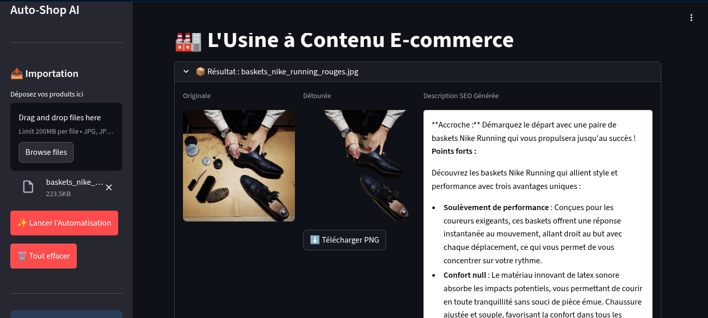

# 🛍️ Auto-Shop AI

> **L'assistant intelligent pour l'automatisation E-commerce.**
> Transformez des photos produits brutes en fiches produits professionnelles (Image détourée + Texte SEO) en quelques secondes.

---

## 📸 Aperçu de l'interface

---

## 🚀 Fonctionnalités

*   **Détourage Automatique (Computer Vision) :** Suppression de l'arrière-plan avec précision grâce au modèle `U2Net` (via `rembg`).
*   **Rédaction SEO (GenAI) :** Génération automatique de descriptions marketing vendeuses basées sur le contexte du produit, propulsée par **LLaMA 3.1** (via OpenRouter).
*   **Stockage Cloud :** Hébergement sécurisé et optimisé des images via **Cloudinary**.
*   **Base de Données :** Persistance de tous les produits traités dans **PostgreSQL**.
*   **Interface Moderne :** Dashboard interactif développé avec **Streamlit** (Support du Bulk Upload, Téléchargement direct).

---

## 💡 Comment obtenir les meilleurs résultats ?

Le système utilise une combinaison de Vision par Ordinateur et d'IA Générative Textuelle.

1.  **Pour le Détourage (Vision) :** Privilégiez des photos où l'objet est bien contrasté par rapport au fond.
2.  **Pour la Description (Texte) :** L'IA utilise actuellement le **nom du fichier** comme contexte principal pour la génération.
    *   ❌ **À éviter :** `IMG_4829.jpg`, `DSC001.png` (L'IA inventera une description).
    *   ✅ **Recommandé :** `baskets_nike_rouge_running.jpg`, `sac_cuir_luxe_noir.png`.
    
    > *Renommez simplement vos fichiers avant l'upload pour guider l'IA et obtenir une description parfaitement pertinente.*

---

## 🏗️ Architecture Technique

Le projet suit une architecture micro-services conteneurisée :

1.  **Backend API (FastAPI) :** Gère la logique métier, l'IA et la base de données.
2.  **Database (PostgreSQL) :** Stocke les métadonnées produits et les liens images.
3.  **Frontend (Streamlit) :** Interface utilisateur connectée à l'API.
4.  **Infrastructure (Docker Compose) :** Orchestration de l'ensemble des services.

## 🛠️ Installation et Démarrage

### Pré-requis
*   Docker & Docker Compose
*   Clés API (Cloudinary & OpenRouter)

### 1. Cloner le projet
git clone https://github.com/VOTRE_NOM/auto-shop-ai.git

cd auto-shop-ai

### 2. Configuration

Créez un fichier .env à la racine :

# Base de données
POSTGRES_USER=autoshop_admin

POSTGRES_PASSWORD=secure_password

POSTGRES_DB=autoshop_db

POSTGRES_SERVER=db

POSTGRES_PORT=5432

# Cloudinary (Stockage Images)
CLOUDINARY_CLOUD_NAME=votre_cloud_name

CLOUDINARY_API_KEY=votre_api_key

CLOUDINARY_API_SECRET=votre_api_secret

# OpenRouter (IA Texte)
OPENROUTER_API_KEY=votre_cle_openrouter

OPENROUTER_MODEL=meta-llama/llama-3.1-8b-instruct

### 3. Lancer l'application

docker-compose up --build -d

### 4. Accès

Interface Utilisateur : http://localhost:8501

Documentation API (Swagger) : http://localhost:8001/docs

